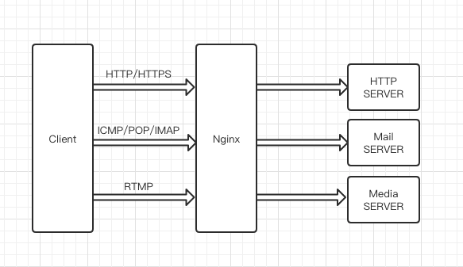
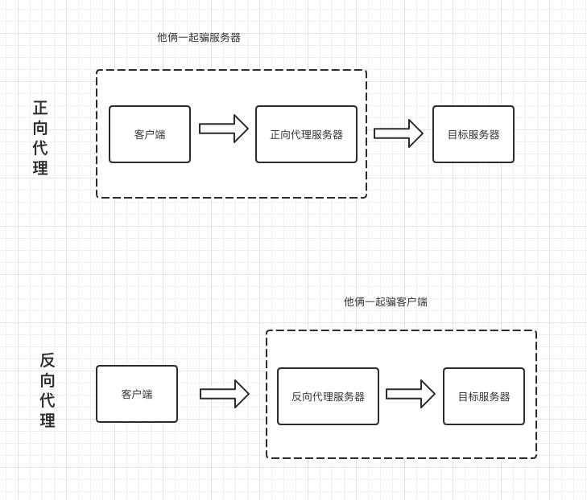

Nginx 服务器的反向代理服务是其最常用的重要功能，反向代理服务也可以衍生出很多榆次相关的Nginx服务器重要功能，比如负载均衡，本文将接受Nginx的代理概念。

##### 代理

在设计模式中，代理模式是这样定义的：给某个对象提供一个代理对象，并由代理对象控制元对象的引用。

举个例子:比如我们要买一件二手房，虽然我们可以自己去找房源，但是花费太多时间和精力了，而且房屋质量检测以及房屋过户等一系列手续也都得我们去办，很麻烦。那么怎么办呢？最简单快捷的方法就是找二手房中介公司，于是我们就委托中介来给我们找合适的房子，以及后续的质量检测过户等操作。我们只需要选自己想要的房子即可，然后交钱。

代理简单来说就是如果我们想做什么，但又不想直接去做，那么这时就找一个人帮忙代理去做。那么这个中介公司就是我们的代理服务，我们委托中介公司帮我们找房子。

Nginx主要代理如下几种协议，其中最常用的就是Http代理服务器。

##### 正向代理

搞懂什么是代理之后，那么什么是正向代理呢？

例子来了：大家都知道，现在国内访问不了Google服务，那么怎么才能访问Google呢？我们又想，美国人不是能访问Google吗？，如果我们电脑的对外IP地址能变成美国的IP地址不就可以访问Google服务了嘛。所以VPN就起到作用了，我们在访问Google的时候，先连上VPN服务器，将我们的IP地址变成美国的IP地址，然后不就能顺利访问了。(同理，这里的美国可以变成任何能访问Google服务的地区)。

这里的VPN就是正向代理 。正向代理服务器位于客户端和服务器之间，为了向服务器获取数据，客户端要向代理服务器发送一个请求，并制定目标服务器，代理服务器将目标服务器返回的数据转交给客户端。这里客户端就是要进行一些正向代理的设置。

另外，这里介绍一下VPN，VPN通俗的讲就是一种中转服务，当我们电脑接入VPN后，我们对外IP地址就变成VPN服务器的公网IP,我们请求或接受任何手机都会通过这个VPN服务器然后传入我们自己的机器。这样做有什么好处呢？比如VPN游戏加速器的原理。我们玩网通区的LOL，但是本机接入的是电信的宽带，玩网通区的就会比较卡，这时候就利用VPN将电信网络变为网通网络，然后玩网通区的LOL就不会卡了（注意，VPN是不能增加带宽的，不要以为不卡了是因为网速提升了，你网速不好怎么都卡）。

##### 反向代理

反向代理和正向代理的区别就是：正向代理代理客户端，反向代理代理服务器端。也可以这么理解，正向代理是客户端伪装了真正的IP之后向服务器发请求，欺骗服务器。反向代理是服务端伪装了真正的IP欺骗客户端，假装是这个IP向客户端返回数据。

反向代理，其实客户端对代理是无感知的，因为客户端不需要任何配置就可以访问。我们只需要将请求发送到反向代理服务器，由反向代理服务器去选择目标服务器获取数据后，在返回给客户端，此时反向代理服务器对外就是一个服务器，暴露的是代理服务器地址，隐藏了真实服务器地址。

理解这两种代理的关键在于代理服务器所代理的对象是什么，正向代理，代理的是客户端，我们需要在客户端进行一些代理的设置。而反向代理，代理的是服务器，作为客户端的我们是无法感知到服务器的真实存在的。